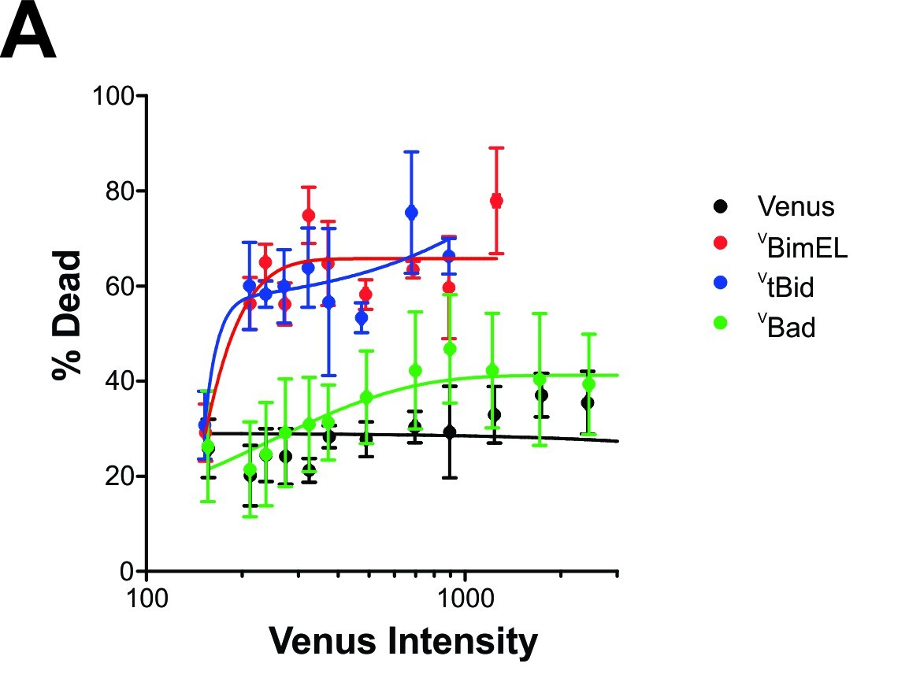

# IntensityVsDeath
Useful DWA Lab  MatLab scripts for creating  death curves from Opera Phenix data
## NOTE: You need to know the format of the generated results text files  
The scripts uses MatLab's textscan() to efficiencly load large text data  
* %d = digits and whole numbers  
* %f = float (decimal)  
* %s = text (string)  
* %q = array ([x,y] where x and y can be any number)  

## Special/Greek Charcters for Older MatLab Versions

## Example Published Data
The scripts were used to create Fig 3. Panel A in our publication:  
The scripts were used to create Fig 3. Panel A in our publication ( Liu, Q., Osterlund, E. J., Chi, X., Pogmore, J., Leber, B., & Andrews, D. W. (2019). Bim escapes displacement by BH3-mimetic anti-cancer drugs by double-bolt locking both Bcl-XL and Bcl-2. Elife, 8, e37689.
 

